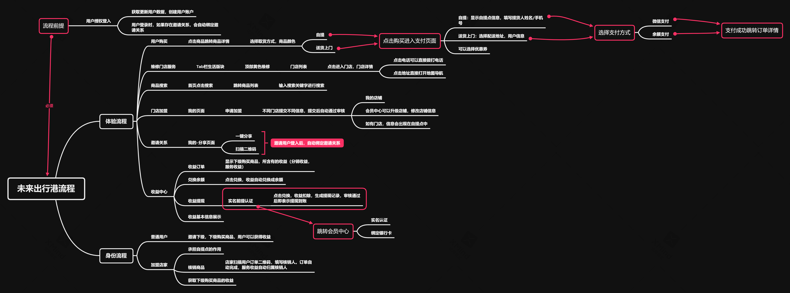

### 未来出行港目录结构

- nova-travel
  - app-auth    用户登录逻辑
  - icon    图标
  - images  静态图片
  - libs    库文件
  - page    页面
    - article   文章页面       在用的
    - barginGoods   特价页面    保留
    - bindDevice    绑定设备
      - deviceInfo  设备详情 开锁、关锁、查看轨迹电量
        - deviceRoute   设备轨迹
    - cauth     用户实名
    - find      智慧出行首页
      - article     文章页面
      - content     文章详情
      - shopInfo    店铺详情
      - storeList   店铺列表
    - help      帮助页面
    - home      首页    保留    之前的
    - my        我的页面
      - active      周边活动    之前的
      - help        帮助页面    之前的
      - league      加盟页面
    - page-view      DIY page页面
    - search        搜索设备页面    保留 之前的
    - share     生活页面
      - startUp        我要创业
    - vip-info      会员信息
      - pay-ways    支付信息绑定
      - real-name   添加银行卡信息
    - index.js      **首页逻辑文件**
    - index.json    **首页配置文件**
    - index.wxml    **首页显示文件**
    - index.wxss    **首页样式文件**
  - uitls   工具文件

### 用户体验/逻辑流程

流程图可能较老缺少部分流程
### 复杂逻辑/混乱的需求

1. 绑定设备
   1. 数据表
      1. Device
         1. userId 指向设备所属用户DeviceUser
      2. DeviceUser     devices字段中会包含用户所有的设备Device
   2. 字段详细信息数据库字段描述有详细解释
   3. 设备会先去查询数据库是否有该设备，如果没有访问皮皮虾数据查询
        皮皮虾数据库没有则绑定失败，皮皮虾数据库有则拷贝至我们数据库并进行绑定设备逻辑
   4. 绑定设备没有图片字段，需要后期考虑，目前设备绑定比较简陋 
2. 设备详情
   1. 操作电动车开锁关锁等操作
      1. 皮皮虾接口在future-server中大部分重写了
         操作指令接口会根据设备中server_url地址获取 **iot** 服务器命令
   2. 轨迹查询调试需要在手机上才看的到，小程序调试看不见
3. 商家订单
   1. 用户选择到店，订单会出现在用户指定的店家订单列表中用户商家核销订单，和分配商家获得的收益。
   
       **问题：**
        因为收益之类的没有接口，目前是前端计算的。需要通过接口计算，和增加**trigger**避免数据抓包现象出现

大部分代码中有注释，看不懂的找我就行

### 后台模块

后台账号密码
账号：pipixia
密码：pipixia123

路由信息已经配置好了的

待完成
1. 发票打印
   文件目录在
    src/modules/future-travel/receipt
    由于具体参数，颜色，纸张大小不清楚 暂且搁置所以未完成。具体需求需要询问陶总
    路由配置是已经配好了的